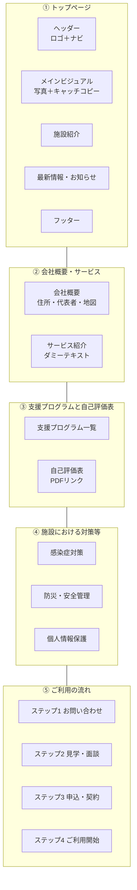

# wp-base-theme

## Tailwind CSS セットアップ

依存関係のインストール
```bash
npm install -D tailwindcss postcss autoprefixer
```

設定ファイルの生成
```bash
npx tailwindcss init
```

tailwind.config.jsを修正
```javascript
module.exports = {
  content: ["./**/*.php"],
  theme: {
    extend: {},
  },
  plugins: [],
}
```

assets/css/tailwind.cssを作成
```css
@tailwind base;
@tailwind components;
@tailwind utilities;
```

ビルドコマンドの実行
```bash
npx tailwindcss -i ./assets/css/tailwind.css -o ./assets/css/style.css --watch
```

functions.phpで読み込み
```php
function custombase_enqueue_assets()
{
    // テーマのメインCSSの読み込み
    wp_enqueue_style(
        'custombase-style',
        get_stylesheet_uri(),
        array(),
        filemtime(get_template_directory() . '/style.css')
    );

    // Tailwindの読み込み（ビルド済みCSS）
    wp_enqueue_style(
        'custombase-tailwind',
        get_template_directory_uri() . '/assets/css/style.css',
        array(),
        filemtime(get_template_directory() . '/assets/css/style.css')
    );

    // JSの読み込み
    wp_enqueue_script(
        'custombase-script',
        get_template_directory_uri() . '/assets/js/script.js',
        array(),
        filemtime(get_template_directory() . '/assets/js/script.js'),
        true // フッターで読み込む
    );
}
add_action('wp_enqueue_scripts', 'custombase_enqueue_assets');
```

.gitignore
```
node_modules/
```

## ワイヤーフレームサンプル


